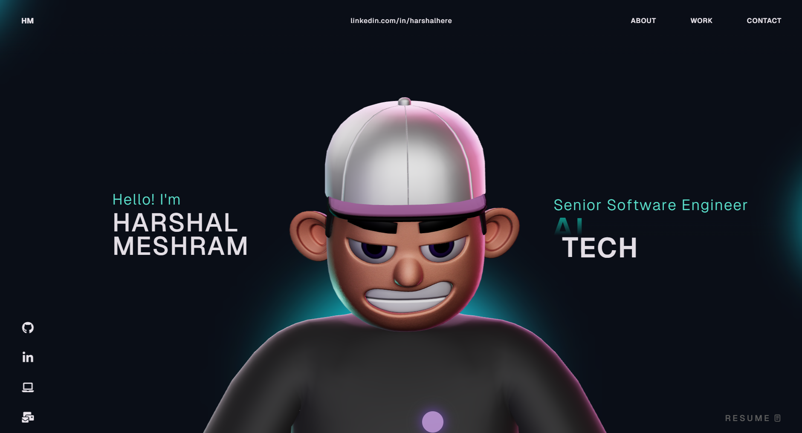

# 🎨 3D Portfolio Website

Welcome to my **3D Portfolio Website**! This project showcases a modern, interactive personal portfolio built with **React**, **TypeScript**, **Three.js**, **React Three Fiber**, and **GSAP**. Explore smooth animations, 3D character scenes, custom cursor effects, and a highly responsive layout—all designed to make a portfolio experience feel alive.

🌐 **Live Demo:** [https://harshalportfolio.netlify.app/](https://harshalportfolio.netlify.app/)



---

## 🚀 Features

- **Interactive 3D Character Scene**: Powered by Three.js and React Three Fiber.  
- **GSAP Animations**: Smooth transitions, scroll-based effects, and hover interactions.  
- **Custom Cursor**: Enhances navigation with dynamic effects.  
- **Responsive Layout**: Works seamlessly across all screen sizes.  
- **Organized Architecture**: Component-driven design with reusable utilities and styling.

---

## 🛠 Tech Stack

**Core:**  
- React 18 | TypeScript | Vite  

**3D & Animations:**  
- Three.js | React Three Fiber | @react-three/drei  
- GSAP + `@gsap/react` | @react-three/postprocessing  
- @react-three/cannon | @react-three/rapier  

**Supporting Libraries:**  
- react-icons | react-fast-marquee | @vercel/analytics  

---

## 🗂 Project Structure

```text
.
├── public/                     # Static assets (images, fonts, etc.)
├── src/
│   ├── assets/                 # Media files and assets
│   ├── components/
│   │   ├── Character/          # 3D character scene and logic
│   │   ├── styles/             # Component-specific CSS/SCSS
│   │   ├── About.tsx
│   │   ├── Career.tsx
│   │   ├── Contact.tsx
│   │   ├── Landing.tsx
│   │   ├── MainContainer.tsx   # Main layout composition
│   │   ├── Navbar.tsx
│   │   ├── TechStack.tsx
│   │   ├── WhatIDo.tsx
│   │   └── Work.tsx
│   ├── context/                # Global context providers
│   ├── data/                   # Static content and configuration
│   ├── App.tsx
│   └── main.tsx
├── package.json
└── vite.config.ts
```

## Getting Started

### Prerequisites

- Node.js 18+ (recommended)
- npm 9+ (or compatible)

### Installation

1. Clone the repository:

   ```bash
   git clone <your-repository-url>
   cd 3d-portfolio
   ```

2. Install dependencies:

   ```bash
   npm install
   ```

3. Start the local development server:

   ```bash
   npm run dev
   ```

4. Open the URL shown in the terminal (typically `http://localhost:5173`).

## Available Scripts

- `npm run dev`  
  Starts Vite dev server and exposes host for local network testing.

- `npm run build`  
  Type-checks and builds a production-ready bundle.

- `npm run preview`  
  Serves the production build locally for verification.

- `npm run lint`  
  Runs ESLint checks across the project.

## GSAP License Note

This project uses the standard `gsap` package, including bonus plugins now available in the core package.

- Install dependencies with `npm install`.
- If migrating from older setups, remove `gsap-trial` from your project.

Read official installation guidance here: [GSAP Installation Docs](https://gsap.com/docs/v3/Installation/)

## Customization Guide

You can adapt this portfolio to your own profile by updating the following areas:

- **Content sections**: Edit files in `src/components/` such as `About.tsx`, `Career.tsx`, `WhatIDo.tsx`, and `Work.tsx`.
- **Data source**: Update static values in files under `src/data/`.
- **Styling**: Modify component styles in `src/components/styles/` and global styles in `src/index.css` / `src/App.css`.
- **3D scene behavior**: Adjust scene logic in `src/components/Character/` and related utilities.
- **Animations**: Tweak GSAP utilities under `src/components/utils/`.

## Deployment

1. Create a production build:

   ```bash
   npm run build
   ```

2. Validate locally:

   ```bash
   npm run preview
   ```

3. Deploy the generated `dist/` folder to your hosting provider (for example Vercel, Netlify, or Cloudflare Pages).

## License

This project is open source and available under the [MIT License](LICENSE).
